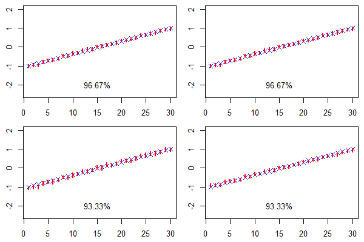
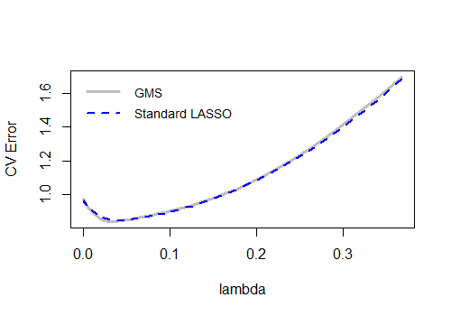

# GMS
This is an R package to implement the Generative Multiple-purpose Sampler (GMS) model in the paper, "Generative Multiple-purpose Sampler for Weighted M-estimation" by Minsuk Shin, Shijie Wang and Jun S Liu. [[paper]](https://arxiv.org/abs/2006.00767)


### Abstract 
GMS is a general computational framework to accelerate repteted calculations for (penalized) weighted M-estimations including (Single/Double) bootstrap methods, cross-validation and non-parametric empirical Bayes. Various models are exmained in paper such as LASSO, quantile regression, logistics regression and nonparametric maximum likelihodd estiamtion (NPMLE).

### Installing the Package
In order to sucessfully run the GMS model, there are several pre-requisites needed to be installed before the R package. The main of GMS is in `Python`, especially __Pytorch__ library and we strongly recommend using `CUDA` (GPU-Based tool) to train GMS which can be accelerated a lot than using `CPU`.
- __Python__ 3.7 or above
- __[Pytroch](https://pytorch.org/)__ 1.11.0 or above
- __[NAVID CUDA](https://developer.nvidia.com/cuda-toolkit)__ 10.2 or above

In R, we also need `reticulate` package to run `Python` in R and `devtools` to install R package from github.
```
install.package("reticulate")
install.package("devtools")
```

Now, use the following code to install `GMS` package.
```
library(devtools)
install_github(repo = "shijiew97/GMS")
library(GMS)
```

### Main function
There are three main functions in the `GMS` package, which is detailed specified below.
- `GMS` aims to train the generator of GMS. __(X,y)__ are the training dataset;__Type__ defines the type of `GMS`: "DoubleBoot": double bootstrap, "CV": cross-validation; "StabSel": stability selection;__Model__ describes the model of interest: "linear":Linear model, "logistic": logistic regression models, "LAD": least absolute deviation regression, "quantile": quantile regression;__NN_type__ specifies the type of neural network structure: "MLP": feed-forwarding NN, "Hadamard": feed-forwarding NN Hadamard producted with the bootstrap weights at the last layer, "lowrank": low rank parameterization.
- `GMS_sampling` generates bootstrap samples using the trained generator from `GMS`. 
- `post_process` Post-processing procedure to evaluate CIs and bias-corrected estimators using object from `GMS_sampling`.
- `GMS_Loading`  loads a pre-trained generator for further training or generation procedure using object from `GMS`.

### Example: Linear Regression 
To illustrate how to use the `GMS` pacakge, we provide sample code for simple linear regression model. The smaple size of simulated data is 500 and corvariate dimension is set to be 30.

- First, generate dataset using following `R` code where true $\theta \in [-1,1]$.
```{r, eval=FALSE}
set.seed(82941)
n = 500
p = 30
bt0 = seq(-1,1,length.out = p)
X = matrix(rnorm(n*p),n,p)
mu0 = crossprod(t(X),bt0)
y = mu0 + rnorm(n)
fit = lm(y~0+X)
theta_hat = fit$coefficients
```
- Next, train GMS generator using `GMS`, obtain double bootstrap samples using `GMS_Sampling` and construct 95% condifence interval using `post_process`.
```{r, eval=FALSE}
fit_GMS = GMS(X, y, model="linear", type="DoubleBoot", NN_type="WM-MLP")
samples_GMS = GMS_Sampling(fit_GMS, B1 = 1000, B10 = 500, X = X, y = y)
res = post_process(samples_GMS, theta_hat = theta_hat, thre=0.001)
```

- Finally, visualizing the results
```{r, eval=FALSE}
par(mfrow=c(2,2),mai=c(0.4,0.4,0.1,0.1))
for(k in 1:4){
    plot(1:p, type="n", ylim=c(-2.5,2))
    CI = res[[k+1]]
    points(bt0, pch=4,col="blue")
    for(j in 1:p){
        lines(rep(j,2), c(CI[j,1],CI[j,2]), col="red",lwd=2)
    }
    cov = 100*length(which(CI[,1]<bt0 & CI[,2]>bt0))/p
    text(p/2,-2, paste(cov,"%",sep=""))
}
```



### Example: Logistics Regression
-Frist, randomly generating dataset of size $n=300, p=30$.
```{r, eval=FALSE}
library(reticulate)
set.seed(82941)
n = 500;p = 30;S = 100
bt0 = seq(-3, 3,length.out = p)
B1 = 3000;B2 = 100;B10 = 100;alpha0 = 0.95;n_b2 = n/S
X = matrix(rnorm(n*p),n,p)
for(j in 1:p){X[,j] = (X[,j] + rnorm(n))/2}
mu = X%*%bt0
prob = 1/(1+exp(-1*mu))
y = matrix(rbinom(n,1,prob), n, 1)
```
-Opitimizing GMS and constructing confidence interval via Double Bootstrap procedure.
```{r, eval=FALSE}
fit_GMS = GMS(X, y, model="logistic", type="DoubleBoot", num_it=25000, lr_power=0.2, L=4, S=100, lr0=0.0001, sgd="Adam", hidden_size=1000, NN_type="WM-MLP")
samples_GMS = GMS_Sampling(fit_GMS, B1=B1, B2=B2, B10=B10, X=X, y=y, type="DoubleBoot", gpu_ind=0)
theta_hat = generator(fit_GMS, w=matrix(1,1,S), verb=0)
res = post_process(samples_GMS, alpha=alpha0, theta_hat=theta_hat)
```


### Example: Cross-Validation for Lasso
In order to run the lasso, R package `mvtnorm` is required and `lars` is required.
- Using the same simulation setting described in paper to simulate the data.
```{r, eval=FALSE}
library(mvtnorm)
set.seed(123456)
n = 500
p = 50
bt0 = rep(0, p);bt0[1:3] = c(1,-2,1)
sigma = matrix(1/2, p, p) + diag(1/2, p, p)
X = matrix(rmvnorm(n, sigma=sigma), n, p)
mu0 = crossprod(t(X), bt0)
y = mu0 + rnorm(n)
y = matrix(y, n, 1)
```
- Using the GMS to fit lasso with cross validation
```{r, eval=FALSE}
lam_cand = exp(seq(-9, -1, length.out=100))
fit_GMS = GMS(X, y, model="linear", type="CV", NN_type="MLP", cv_K=10, S=100, K0=10, lam_schd=lam_cand*2)
samples_GMS = GMS_Sampling(fit_GMS, B1=1000, B10 =1000, X=X, y=y)
```
- Using classic `LARS` to obtain the standard cross validation 
```{r, eval=FALSE}
nfold = 10
fold_ind = rep(1:10, each=n/10)
cv_lasso = function(X, y, lam, n){
   library(lars)
   cv_err = matrix(0, nfold, length(lam))
   for (i in 1:nfold){
     fit_lasso = lars(X[fold_ind!=i, ], y[fold_ind!=i, ], type="lasso", intercept=F, normalize=F)
     for (j in 1:length(lam)){
        yhat = predict(fit_lasso, X[fold_ind==i,], lam[j]*n, mode="lambda", type="fit")$fit
        cv_err[i,j] = mean( (yhat-y[foldid==i])^2 )
        }}
   return(colMeans(cv_err)) }
fit_lasso = cv_lasso(X, y, lam_cand, n)
```

- Visualizing the results
```{r, eval=FALSE}
plot(samples_GMS$lam_schd*0.5, samples_GMS$CV_err, col="grey", type="l", lwd=3, xlab="lambda", ylab="CV Error")
points(lam_cand, fit_lasso, type="l", col="blue", lty=2, lwd=2, ylim=c(1.0, 2.2))
legend("topleft", c("GMS","Standard LASSO"), col=c("grey","blue"), lty=c(1,2), bty="n", cex=0.9, lwd=c(3,2))
```



